# Gomoku-C

<div align="center">

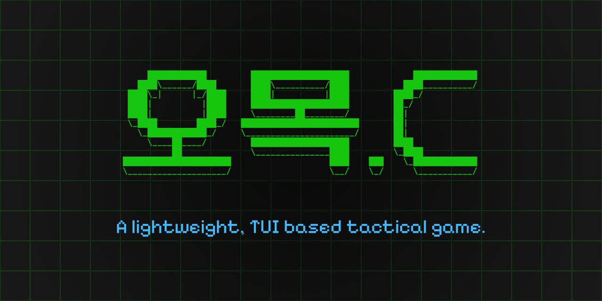

**터미널에서 즐기는 본격 오목 게임**

[](LICENSE)
[]()
[]()

[설치하기](#설치-방법) | [게임 시작하기](#게임-시작하기) | [조작법](#조작법) | [기능 소개](#주요-기능)

</div>

---

## 소개

**Gomoku-C**는 Linux/WSL2 환경에서 실행되는 터미널 기반 오목 게임입니다.

혼자서 AI와 대결하거나, 친구와 네트워크를 통해 대전할 수 있습니다. ncurses 라이브러리를 활용하여 터미널에서도 깔끔하고 직관적인 UI를 제공합니다.

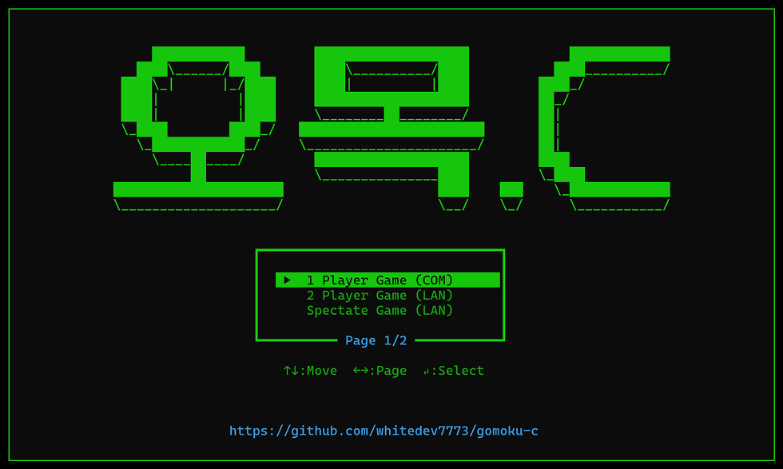

### 왜 Gomoku-C인가요?

- **설치가 간단합니다** - 몇 줄의 명령어로 바로 플레이 가능
- **네트워크 대전 지원** - 친구와 LAN 또는 인터넷으로 대전
- **AI 대전 지원** - 혼자서도 쉬움/어려움 난이도의 AI와 대결
- **관전 모드** - 다른 사람의 게임을 실시간으로 관전
- **리플레이 기능** - 지난 게임을 다시 보며 복기
- **다양한 테마** - 취향에 맞는 색상 테마 선택
- **게임패드 지원** - 키보드 외에 게임패드로도 조작 가능

---

## 스크린샷

<div align="center">

|           싱글 플레이 with AI            |     멀티플레이 with Chat      |
| :--------------------------------------: | :---------------------------: |
| 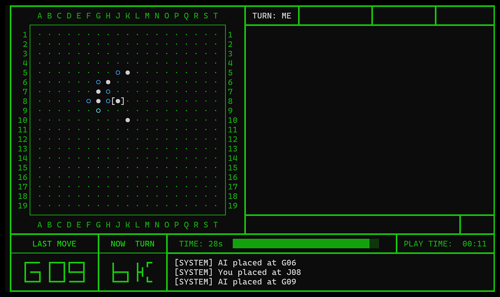 | 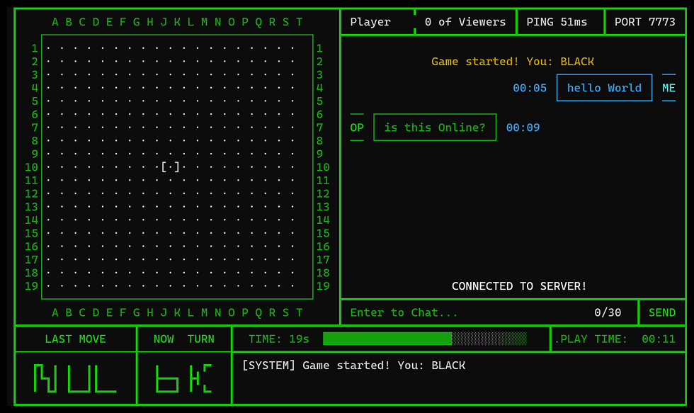 |

|            테마 선택            |              리플레이               |
| :-----------------------------: | :---------------------------------: |
| 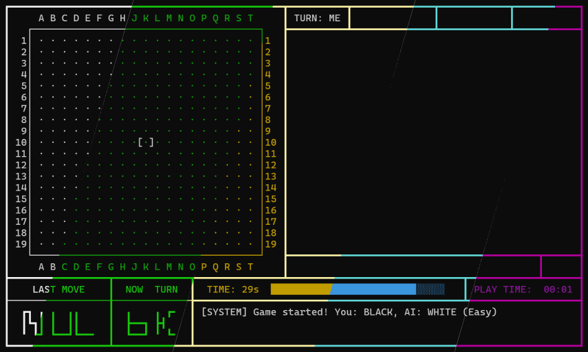 | 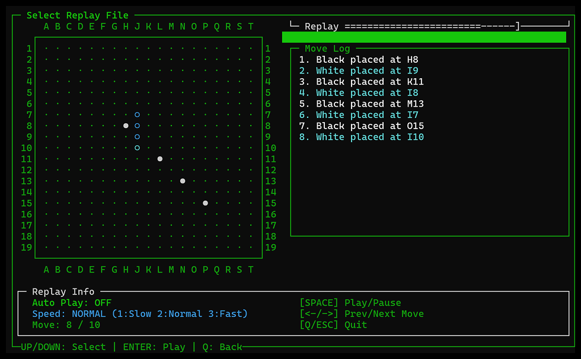 |

</div>

---

## 설치 방법

### 요구 사항

- **운영체제**: Linux (Ubuntu/Debian 권장) 또는 WSL2
- **터미널 크기**: 최소 120 x 31 (자동으로 확인됨)

### Step 1: 필수 패키지 설치

터미널을 열고 아래 명령어를 실행하세요:

**Ubuntu / Debian:**

```bash
sudo apt-get update
sudo apt-get install -y build-essential libncursesw5-dev git
```

**Fedora / RHEL:**

```bash
sudo dnf install -y gcc ncurses-devel git
```

### Step 2: CMake 설치 (3.10 이상 필요)

#### 방법 1: apt로 간편 설치 (구버전, 빠름)

```bash
sudo apt-get install -y cmake
```

> **참고**: Ubuntu 18.04 이상에서는 CMake 3.10 이상이 설치됩니다.

#### 방법 2: 최신 버전 직접 설치 (권장)

apt로 설치한 CMake 버전이 낮거나, 최신 버전이 필요한 경우:

```bash
# 기존 cmake 제거 (설치되어 있는 경우)
sudo apt-get remove -y cmake

# CMake 3.28.1 다운로드 및 설치
wget https://github.com/Kitware/CMake/releases/download/v3.28.1/cmake-3.28.1-linux-x86_64.sh
chmod +x cmake-3.28.1-linux-x86_64.sh
sudo ./cmake-3.28.1-linux-x86_64.sh --skip-license --prefix=/usr/local

# 설치 확인
cmake --version
```

> **참고**: `/usr/local/bin`이 PATH에 포함되어 있어야 합니다. 포함되어 있지 않다면:
>
> ```bash
> echo 'export PATH=/usr/local/bin:$PATH' >> ~/.bashrc
> source ~/.bashrc
> ```

### Step 3: 소스 코드 다운로드

```bash
git clone https://github.com/whitedev7773/gomoku-c.git
cd gomoku-c
```

### Step 4: 빌드 및 실행

```bash
./build_and_run.sh
```

이게 전부입니다! 게임이 자동으로 빌드되고 실행됩니다.

> **참고**: 빌드에 문제가 있다면 클린 빌드를 시도해보세요:
>
> ```bash
> ./build_and_run.sh --clean
> ```

---

## 게임 시작하기

### 메뉴 모드 (권장)

가장 간단한 방법입니다. 메뉴에서 원하는 모드를 선택하세요:

```bash
./build/gomoku-c
```


### 명령줄 옵션으로 바로 시작

메뉴를 거치지 않고 바로 게임을 시작할 수 있습니다:

#### 싱글플레이 (AI 대전)

```bash
# 쉬운 난이도
./build/gomoku-c --singleplay --easy

# 어려운 난이도
./build/gomoku-c --singleplay --hard
```

#### 멀티플레이 (친구와 대전)

**호스트 (게임 방 만들기):**

```bash
./build/gomoku-c --multiplay-host
```

화면에 표시되는 IP 주소를 친구에게 알려주세요.

**클라이언트 (게임 방 참가):**

```bash
./build/gomoku-c --multiplay-client -ip 192.168.0.10
```

포트를 지정하려면 (기본값: 7773):

```bash
./build/gomoku-c --multiplay-client -ip 192.168.0.10 -port 7773
```

#### 관전 모드

진행 중인 게임을 관전할 수 있습니다 (최대 3명):

```bash
./build/gomoku-c --spectator -ip 192.168.0.10
```

---

## 조작법

### 인게임 조작

|        키        | 동작                  |
| :--------------: | :-------------------- |
| `↑` `↓` `←` `→`  | 커서 이동             |
|     `Space`      | 돌 놓기               |
| `Enter` 또는 `T` | 채팅 모드 진입        |
|      `ESC`       | 채팅 모드 종료 / 메뉴 |

### 채팅 명령어

채팅창에서 특수 명령어를 입력할 수 있습니다:

|  명령어   | 설명                                          |
| :-------: | :-------------------------------------------- |
|  `/help`  | 사용할 수 있는 명령어 표시                    |
|  `/quit`  | 게임 퇴장                                     |
|  `/undo`  | 무르기 요청 (상대방 수락 필요, 10초 타임아웃) |
| `/giveup` | 기권 (즉시 패배)                              |
|  `/swap`  | Swap (흑백 순서 교환)                         |

> **팁**: `/q`까지만 입력하면 나머지 글자가 자동완성으로 표시됩니다.

---

## 주요 기능

### 1. 싱글플레이 - AI 대전

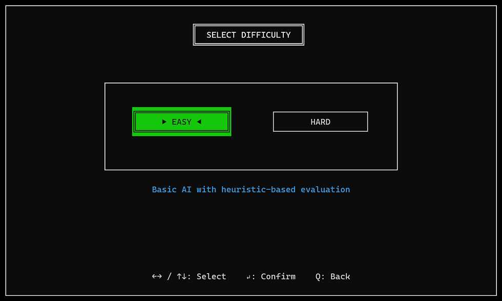

혼자서 AI와 대결할 수 있습니다:

- **Easy 모드**: 오목을 처음 접하는 분들을 위한 쉬운 난이도
- **Hard 모드**: 미니맥스 알고리즘 기반의 강력한 AI

플레이어는 항상 흑돌(선공)로 시작합니다.

### 2. 멀티플레이 - 네트워크 대전

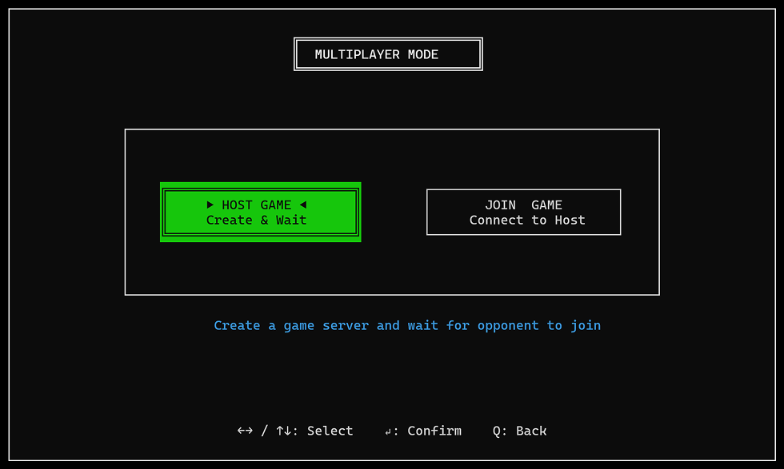

|                     HOST 모드                      |                 CLIENT(JOIN) 모드                  |
| :------------------------------------------------: | :------------------------------------------------: |
| 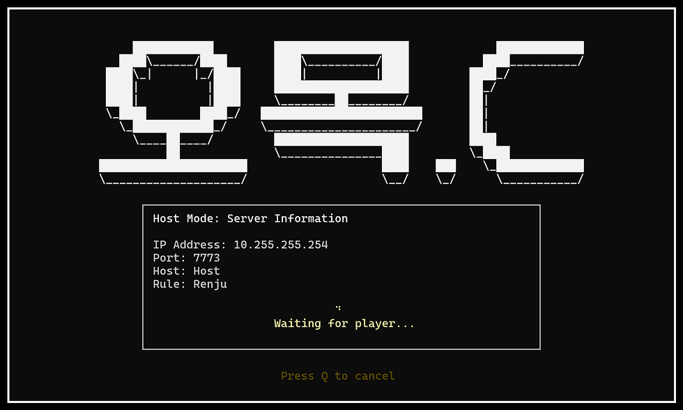 | 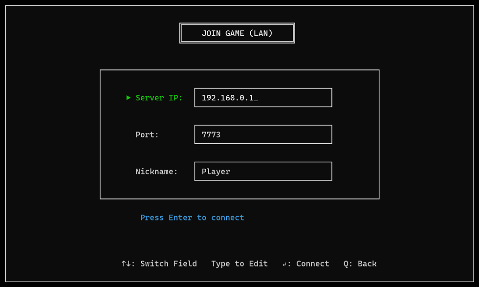 |

TCP 소켓을 이용한 네트워크 대전을 지원합니다:

- **LAN 대전**: 같은 네트워크에 있는 친구와 대전
- **인터넷 대전**: 포트포워딩 설정 시 외부 네트워크에서도 대전 가능
- **도메인 지원**: IP 대신 도메인 주소로도 접속 가능

### 3. 관전 모드

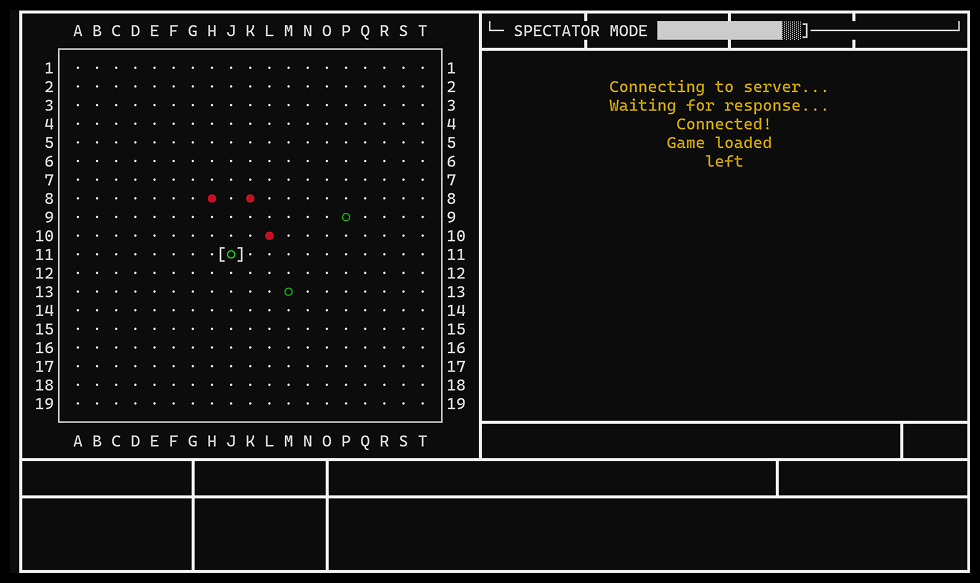

진행 중인 게임을 실시간으로 관전할 수 있습니다:

- 최대 3명의 관전자 지원
- 실시간 게임 상태 동기화
- 채팅 관람 가능

### 4. 리플레이


모든 게임은 자동으로 기록됩니다:

- 파일 형식: `gomoku-YYYYMMDD-HH:MM.log`
- 메뉴에서 리플레이를 선택하여 지난 게임 재생
- `/quit` 명령어로 리플레이 종료

### 5. 실시간 채팅

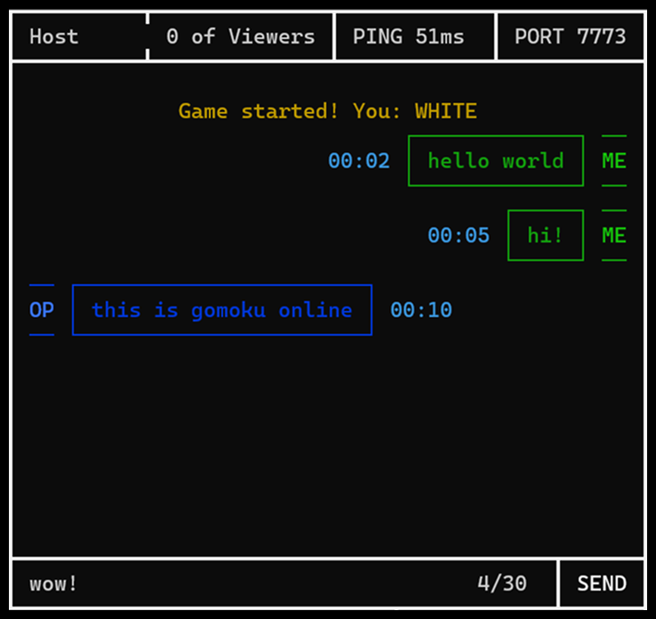

게임 중 상대방과 채팅할 수 있습니다:

- 말풍선 스타일의 채팅 UI
- 최대 15자까지 입력 가능
- 시스템 메시지 표시 (입장, 착수 위치 등)

### 6. 테마 커스터마이징

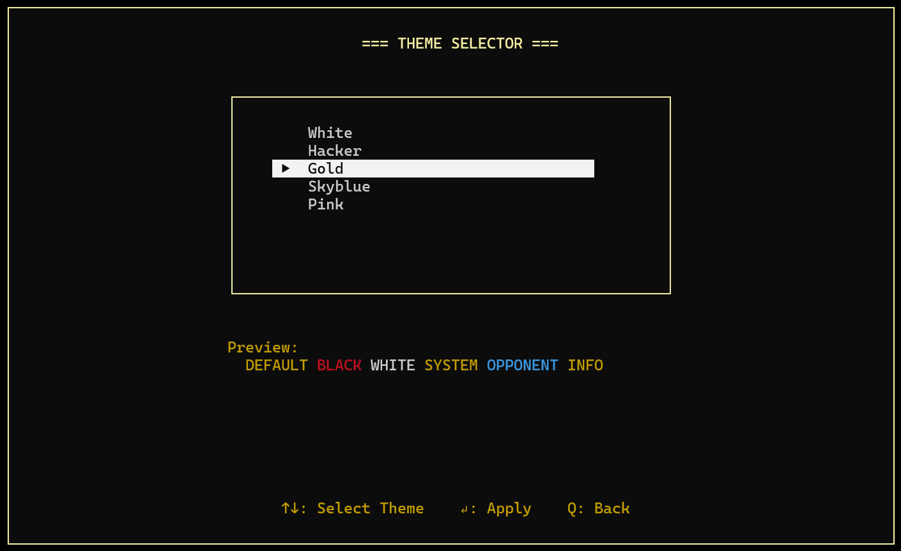

다양한 색상 테마를 지원합니다:

|  테마   | 설명             |
| :-----: | :--------------- |
|  White  | 기본 흰색 테마   |
| Hacker  | 녹색 해커 스타일 |
|  Gold   | 황금빛 고급 테마 |
| Skyblue | 시원한 하늘색    |
|  Pink   | 핑크 테마        |
| Rainbow | 무지개 색상      |

### 7. 공정한 게임 규칙

Gomoku-C는 프로 오목 규칙을 적용합니다:

#### Renju Rule (렌주 룰)

흑돌의 선공 이점을 보정하기 위한 규칙:

- **삼삼 금지**: 동시에 두 개의 열린 3을 만들 수 없음
- **사사 금지**: 동시에 두 개의 4를 만들 수 없음
- **육목 금지**: 6개 이상 연속으로 놓을 수 없음

#### Swap Rule (스왑 룰)

공정한 시작을 위한 규칙:

- 첫 3수(흑1, 백1, 흑2) 후 백이 흑백 교체를 선택할 수 있음

---

## 문제 해결

### 터미널 크기가 너무 작다고 나와요

터미널 창의 크기를 **120 x 31** 이상으로 조절해주세요. 현재 크기는 화면에 표시됩니다.

### UTF-8 문자가 깨져 보여요

locale 설정을 확인하세요:

```bash
export LANG=ko_KR.UTF-8
export LC_ALL=ko_KR.UTF-8
```

### ncursesw를 찾을 수 없다고 해요

```bash
# Ubuntu/Debian
sudo apt-get install libncursesw5-dev

# Fedora/RHEL
sudo dnf install ncurses-devel
```

### 빌드가 실패해요

클린 빌드를 시도해보세요:

```bash
rm -rf build
./build_and_run.sh
```

### 네트워크 연결이 안 돼요

1. 호스트와 클라이언트가 같은 네트워크에 있는지 확인
2. 방화벽에서 포트 7773이 열려 있는지 확인
3. 외부 네트워크라면 포트포워딩 설정 필요

---

## 프로젝트 구조

```
gomoku-c/
├── src/
│   ├── main.c                 # 프로그램 진입점
│   ├── game/                  # 게임 로직
│   │   ├── core/              # 보드, 규칙, 턴 관리
│   │   ├── ai/                # AI 엔진
│   │   ├── mode/              # 싱글/멀티/관전 모드
│   │   └── feature/           # 로거 등 부가 기능
│   ├── ui/                    # 사용자 인터페이스
│   │   ├── core/              # UI 핵심, 테마, 입력 처리
│   │   ├── menu/              # 메뉴 화면
│   │   └── game/              # 게임 화면 (보드, 채팅, 정보창)
│   ├── network/               # 네트워크 통신
│   │   ├── core/              # TCP 소켓, 클라이언트/서버
│   │   └── messages/          # 프로토콜 메시지
│   └── utils/                 # 유틸리티 함수
├── docs/
│   └── images/                # README 이미지
├── CMakeLists.txt             # CMake 빌드 설정
├── build_and_run.sh           # 빌드 및 실행 스크립트
└── README.md                  # 이 문서
```

---

## 기여하기

버그 리포트, 기능 제안, Pull Request를 환영합니다!

1. 이 저장소를 Fork 합니다
2. 새 브랜치를 만듭니다 (`git checkout -b feature/amazing-feature`)
3. 변경사항을 커밋합니다 (`git commit -m 'feat: Add amazing feature'`)
4. 브랜치에 Push 합니다 (`git push origin feature/amazing-feature`)
5. Pull Request를 생성합니다

---

## 라이선스

이 프로젝트는 MIT 라이선스로 배포됩니다. 자세한 내용은 [LICENSE](LICENSE) 파일을 참조하세요.

---

## 세부 기능 명세

### 게임 보드 및 규칙

| 항목           | 상세                                    |
| :------------- | :-------------------------------------- |
| 보드 크기      | 19 x 19 바둑판                          |
| 돌 종류        | 흑돌 (●), 백돌 (○)                      |
| 승리 조건      | 가로/세로/대각선으로 5개 연속           |
| 금수 표시      | 금수 위치 실시간 표시 (렌주 룰 적용 시) |
| 마지막 수 표시 | 최근 착수 위치 하이라이트               |
| 수 기록        | 최대 361수 (19×19) 기록                 |

### 게임 규칙 시스템

#### Standard (기본) 룰

- 제한 없이 자유롭게 착수
- 6목 이상도 승리로 인정

#### Renju (렌주) 룰

| 금수 종류 | 설명                                   | 적용 대상 |
| :-------- | :------------------------------------- | :-------- |
| 삼삼 금지 | 동시에 두 개의 열린 3을 만드는 수 금지 | 흑돌만    |
| 사사 금지 | 동시에 두 개의 4를 만드는 수 금지      | 흑돌만    |
| 장목 금지 | 6개 이상 연속으로 놓는 수 금지         | 흑돌만    |

#### Swap (스왑) 룰

- 첫 3수 (흑1, 백1, 흑2) 후 백이 `/swap` 명령으로 흑백 교체 가능
- 선공 이점 보정을 위한 공정성 규칙

### AI 엔진

| 난이도 | 알고리즘                     | 특징                                    |
| :----- | :--------------------------- | :-------------------------------------- |
| Easy   | 휴리스틱 기반                | 패턴 인식 기반의 간단한 AI, 초보자 대상 |
| Hard   | Minimax + Alpha-Beta Pruning | 탐색 기반 강력한 AI, 숙련자 대상        |

### 네트워크 시스템

#### 프로토콜 사양

| 항목               | 값     |
| :----------------- | :----- |
| 전송 프로토콜      | TCP/IP |
| 기본 포트          | 7773   |
| 프로토콜 버전      | 1      |
| 최대 플레이어 이름 | 8자    |

#### 메시지 타입

| 코드  | 메시지           | 용도               |
| :---: | :--------------- | :----------------- |
|   1   | CONNECT          | 연결 요청          |
|   2   | CONNECT_ACK      | 연결 승인          |
|   3   | PLAYER_INFO      | 플레이어 정보 교환 |
|   4   | GAME_START       | 게임 시작 신호     |
|   5   | MOVE             | 돌 놓기            |
|   6   | MOVE_ACK         | 착수 승인          |
|   7   | CURSOR_UPDATE    | 커서 위치 동기화   |
|   8   | CHAT             | 채팅 메시지        |
| 9-10  | PING/PONG        | 연결 상태 확인     |
|  11   | DISCONNECT       | 연결 종료          |
| 12-13 | COMMAND/RESPONSE | 명령어 처리        |
| 14-17 | SPECTATOR\_\*    | 관전자 관련        |
|  18   | GAME_STATE       | 전체 게임 상태     |
|  19   | GAME_RESULT      | 게임 결과          |

#### 관전 모드

- 최대 3명의 관전자 동시 접속
- 실시간 보드 상태 동기화
- 채팅 관람 가능
- 게임 중간 참여 가능 (현재 상태 전송)

### 게임패드 지원 (Xbox Controller)

| 버튼/입력         | 동작            |
| :---------------- | :-------------- |
| A 버튼            | 돌 놓기 (Space) |
| B 버튼            | 취소/뒤로 (ESC) |
| X 버튼            | 무르기 요청     |
| Y 버튼            | 기권            |
| Back 버튼         | 나가기          |
| Start 버튼        | 채팅 모드 진입  |
| 왼쪽 스틱 / D-Pad | 커서 이동       |

#### 게임패드 기능

- 자동 디바이스 감지 (`/dev/input/js*`)
- 아날로그 스틱 데드존 처리
- 반복 입력 지원 (딜레이 후 연속 입력)
- D-Pad 및 아날로그 스틱 모두 지원

### 채팅 시스템

| 항목             | 상세                      |
| :--------------- | :------------------------ |
| 최대 메시지 길이 | 30자                      |
| 메시지 버퍼      | 최근 10개 저장            |
| 메시지 타입      | 사용자, 상대방, 시스템    |
| 타임스탬프       | MM:SS 형식 게임 시간 표시 |

#### 채팅 명령어

| 명령어    | 설명        | 비고                             |
| :-------- | :---------- | :------------------------------- |
| `/quit`   | 게임 퇴장   | 즉시 실행                        |
| `/undo`   | 무르기 요청 | 상대방 수락 필요 (10초 타임아웃) |
| `/giveup` | 기권        | 즉시 패배 처리                   |
| `/swap`   | 흑백 교체   | 첫 3수 후 백만 사용 가능         |
| `/help`   | 도움말      | 명령어 목록 표시                 |

#### 자동완성 기능

- `/q` 입력 시 `/quit` 힌트 표시
- `/u` 입력 시 `/undo` 힌트 표시
- Tab 또는 계속 입력으로 자동완성

### 테마 시스템

| 테마 ID | 이름    | 색상 특징                    |
| :-----: | :------ | :--------------------------- |
|    0    | White   | 기본 흰색, 깔끔한 인터페이스 |
|    1    | Hacker  | 녹색 텍스트, 해커 감성       |
|    2    | Gold    | 황금색, 고급스러운 느낌      |
|    3    | Skyblue | 하늘색, 시원한 느낌          |
|    4    | Pink    | 핑크색, 귀여운 느낌          |

#### 테마 적용 영역

- 기본 텍스트 색상
- 반전 색상 (모달 배경)
- 흑돌/백돌 강조 색상
- 시스템 메시지 색상
- 상대방 채팅 색상
- 정보 텍스트 색상
- 비활성 텍스트 색상

#### 테마 저장

- `.gomoku-config` 파일에 설정 저장
- 프로그램 재시작 시 자동 로드

### 리플레이 시스템

| 항목      | 상세                        |
| :-------- | :-------------------------- |
| 파일 형식 | `gomoku-YYYYMMDD-HH:MM.log` |
| 저장 위치 | 실행 디렉토리               |
| 자동 저장 | 모든 게임 자동 기록         |

#### 리플레이 기능

- 게임 목록에서 파일 선택
- 순차적 수 재생
- `/quit` 명령으로 리플레이 종료
- 게임 정보 표시 (플레이어, 결과 등)

### 명령줄 옵션

| 옵션                  | 설명            | 예시                                             |
| :-------------------- | :-------------- | :----------------------------------------------- |
| (없음)                | 메뉴 모드       | `./gomoku-c`                                     |
| `--singleplay --easy` | 쉬운 AI 대전    | `./gomoku-c --singleplay --easy`                 |
| `--singleplay --hard` | 어려운 AI 대전  | `./gomoku-c --singleplay --hard`                 |
| `--multiplay-host`    | 호스트 모드     | `./gomoku-c --multiplay-host`                    |
| `--multiplay-client`  | 클라이언트 모드 | `./gomoku-c --multiplay-client -ip 192.168.0.10` |
| `--spectator`         | 관전 모드       | `./gomoku-c --spectator -ip 192.168.0.10`        |
| `-ip <주소>`          | IP 주소 지정    | `-ip 192.168.0.10` 또는 `-ip example.com`        |
| `-port <포트>`        | 포트 지정       | `-port 7773` (기본값: 7773)                      |

### UI 시스템

#### 화면 구성

| 영역      | 내용                                       |
| :-------- | :----------------------------------------- |
| 상단 정보 | 플레이어 이름, 색상 표시                   |
| 게임 보드 | 19x19 바둑판, 커서, 돌 표시                |
| 하단 정보 | 현재 턴, 마지막 수, 경과 시간, 시스템 로그 |
| 채팅 영역 | 메시지 목록, 입력창                        |

#### 최소 터미널 요구사항

- 가로: 120 컬럼
- 세로: 31 행
- 자동 크기 검사 및 안내

#### 렌더링 최적화

- Dirty Flag 기반 선택적 렌더링
- 변경된 영역만 다시 그리기
- ncurses 더블 버퍼링 활용

### 설정 파일

#### `.gomoku-config`

```
theme=0
player_name=Player
```

| 설정        | 설명            | 기본값    |
| :---------- | :-------------- | :-------- |
| theme       | 테마 번호 (0-4) | 0 (White) |
| player_name | 플레이어 이름   | Player    |

---

<div align="center">

**Gomoku-C** - 터미널에서 즐기는 오목의 재미

Made with C and ncurses

</div>
